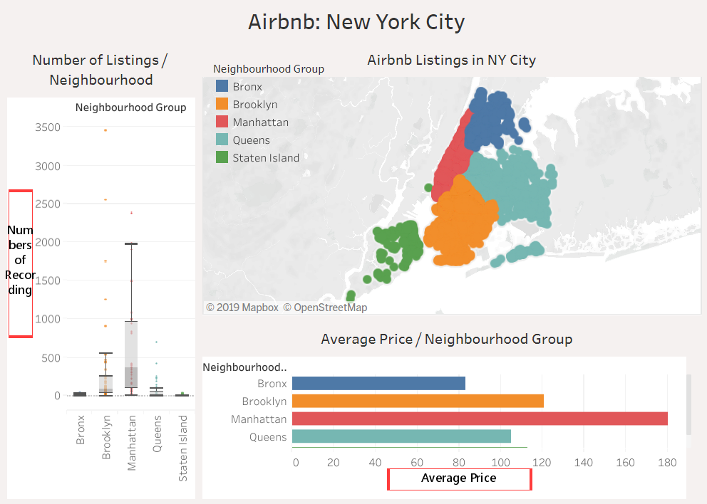
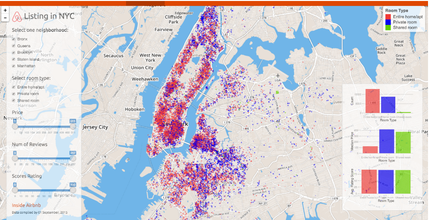

# Project Proposal

## New York City Airbnb

**Project:** A Data Analysis and Visualization of New York City Airbnb Distribution in 2019.

**Group members:**
* Klein Wang (kleinwang743@gmail.com)
* Lexi Xia (Lexiisxia@gmail.com)
* Lei Lei (leilei09282000@gmail.com)
* Shawn Song (songshaobo2000@gmail.com)

Info-201: Technical Foundations of Informatics 
The Information School 
University of Washington 
Autumn 2019

### 1.0 Introduction

**1.1 Problem situation**

We are researching Airbnb in New York, 2019. The stakeholders of Airbnb is the hosts who run Airbnb as well as the neighborhood associations who give a lot of regulations and prohibitions to them. Their values and tensions come from financial problems, tourist satisfactions and how the surrounding places are changing. While Airbnb makes many tourists life more convenient, it also causes some unavoidable policy and ethical issues. The hosts may not enforce the local lodging law or may violate the housing contract. The attraction of more tourists may impact the local community in many ways such as environmental pollutions and property regulations. Also, the hosts are able to decide their own guests with discriminations.

**1.2 What is the problem?**

Our problem is to find out the information of Airbnb in New York, 2019 by analyzing datasets, including the price levels, distribution of different types and locations, etc. As Airbnb becomes more popular in the past decades, we also look for some relations between them and some key facts such as safety issues, tourist attractions, natural humanities and sceneries.

**1.3 What does it matter?**

Nowadays, Airbnb has become an increasingly popular way for travelers to expand their travel possibilities and experience the city in a more unique way. In our research, the analysis of the data set can help us understand what are some of the most important factors that contribute to the distribution of Airbnb in New York City. And also to understand Which type of Airbnb do people prefer in current days.

**1.4 How it will be addressed?**

We will begin our research by analyzing the relationship between the locations and the number of Airbnbs using the data from the first data set. Then, we will analyze the possible correlation between the crime rate and the number of Airbnbs in the regions. It is very likely that we'll examine some more data that contribute to the distribution of Airbnbs in the later works. The analysis can be presented through data visualization. Since the data set may be affected by feedback loops and other factors, more information may be needed throughout the study.

### 2.0 Research questions

* What is the most popular type of Airbnb in New York City?

* Is there a trend between the number of crimes and the number of Airbnbs in that area?

* Are there any correlations between availability days and locations?

### 3.0 Possible data sets

**Data set 1: New York City Airbnb Data**

* _Web URL:_ https://www.kaggle.com/dgomonov/new-york-city-airbnb-open-data

_number of observations:_ 397

_number of attributes:_ 16

**Description:** The first data set includes information needed to analyze New York Airbnb, including area, location, owner, review count and price of Airbnbs in New York City. This is an up-to-date dataset that can be used to generate information about Airbnb in 2019.

**Date set 2: NYPD Complaint Data**

* _Web URL:_ https://data.cityofnewyork.us/Public-Safety/NYPD-Complaint-Data-Current-Year-To-Date-/5uac-w243

_number of observations:_ 347676

_number of attributes:_ 35

**Description:** This data set contains the complete records of crimes in New York City in 2019, including date, time, crime type, location, race, sex, etc. In this project, we'll mainly analyze the information of location in this data set and how the distribution of Airbnb may attribute to the public safety in that region.

### 4.0 Information Visualization
These two graphics below help us to visualize the popular neighborhood where
Airbnb housing gathers, and also the popular room type that customer would
like to choose.

`ALT`

*Figure 1.* This graphic shows the distribution of Airbnb housing each
neighborhood in New York City, and also the average price for each
neighborhood group. (*_Source_* : Inside Airbnb) [1]

`ALT`

*Figure 2.* This graphic also displays the distribution of Airbnb
housing, but with different room types. (*_Source_* : NYC Data
Science Academy) [2]

### 5.0 Team Coordination
**Meeting Time:** Every Sunday morning start from 10 am, and finish around 2-3 pm. Every Wednesday afternoon from 4-5:30 pm.

**Klein Wang**
My individual goal for the project is learn to apply markdown software in a
real life problem. My role is to find two visualized graph and make brief
description for them, and also think and discuss about the main problem we have for our final project. Mostly, we gather in a study lounge or library to work on our final project. For the final project, we discuss the outline and summary for the project first, then we will distribute the work evenly so that we could all finish our job around the same time. When we face challenge, we would ask for each other's help. If we don't know how to solve it, we will use other helping tools like Microsoft Team and websites about our issues.

**Lexi Xia**
My goal is to learn to create an interactive visualization for exploring the data set with appropriate UI dialog controls. I want to learn how to cooperate better with teammates in the group project and get more familiar with Rstudio and Github.

**Lei Lei**
We will communicate weekly both in person and through group chat.
We will give each other feedback on working together and address communication challenges or work breakdowns.
My personal goal is to better understand what factors might make Airbnb popular. I also want to learn how to effectively use the knowledge I learned in Information 201, especially on how to create effective data visualization. My role in this group is writer.  

**Shawn Song**

I'm mainly a writer in this project and my individual goal is to get a good score on the project while having a basic understanding of Airbnb. I'll get together with my group members in a study lounge or in a library every weekend, talking and discussing any challenge or feedbacks we've met, and help each other solve problems they can't solve in their own part.

### 6.0 Questions for Teaching Team

Currently no question for the teaching team.

### 7.0 References

[1] Cox, M. (2019). *_Airbnb:New York City_* Retrieved from
http://insideairbnb.com/get-the-data.html

[2] Ma, A. (Mar 2, 2016). *_Listing in NYC_* Retrieved from
https://nycdatascience.com/blog/student-works/how-airbnb-is-in-nyc-interactive-data-visualization-in-r/
